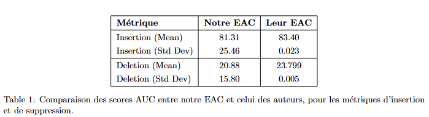
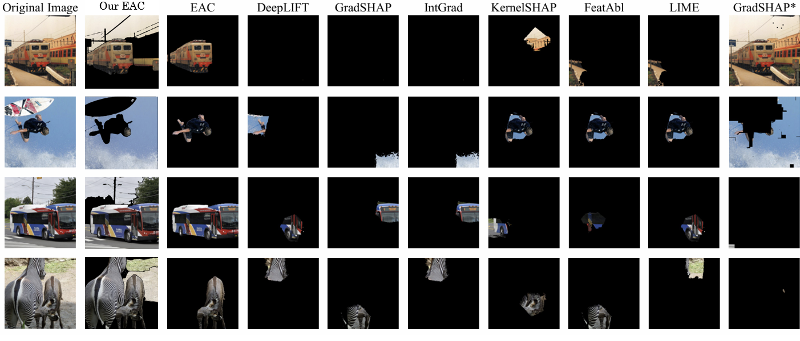

# XAI_Explain_Any_Concept

## Introduction

Les réseaux de neurones profonds (DNN) sont performants en vision par ordinateur mais restent opaques, ce qui limite leur utilisation dans des domaines sensibles. Pour rendre leurs décisions plus transparentes, l’Explainable AI (XAI) s’appuie souvent sur des explications au niveau des pixels, qui manquent de fidélité et sont difficiles à comprendre.

Le papier original utilise le Segment Anything Model (SAM) pour extraire automatiquement des concepts visuels, combiné à une méthode basée sur les valeurs de Shapley pour fournir des explications fidèles, compréhensibles et efficaces via leur pipeline Explain Any Concept (EAC).

Nous reproduisons ici leurs expériences afin de valider les performances et la qualité d’interprétation de cette méthode sur des jeux de données standards.

## Résultats expérimentaux

### Évaluation Faithfulness : Insertion & Deletion

**Conclusion :**  
Les performances sont globalement similaires, mais notre version présente une variabilité plus élevée (écarts-types plus importants), probablement due à un échantillon réduit (4 images) contre 100 images dans le papier original.

### Évaluation humaine : Explicability

**Protocole :**  
6 participants (étudiants en IA) ont comparé les explications générées par notre EAC avec celles des méthodes de référence (extraits du papier).

**Résultat :**  
Sur les 4 images testées, EAC a systématiquement été préféré. Les autres méthodes n’ont pas montré d’avantage significatif.

**Interprétation :**  
Ces résultats indiquent que EAC produit des explications plus compréhensibles pour les humains.

### Étude efficiency 

Comparaison entre notre implémentation PIE, la version originale et le calcul direct des valeurs de Shapley.

| Méthode        | Temps par image |
|----------------|-----------------|
| Notre PIE      | ~10 minutes     |
| PIE (papier)   | ~4 minutes      |
| Shapley direct | >24 heures      |

**Conclusion :**  
Notre implémentation est moins optimisée que celle du papier (probablement à cause du matériel ou du pipeline), mais reste largement plus scalable que le calcul exact.

---

## Equipe

Candice Bouquin-Renoux, Lily Daganaud, Sarah Garcia, Dan Hayoun et Ines Lalou

